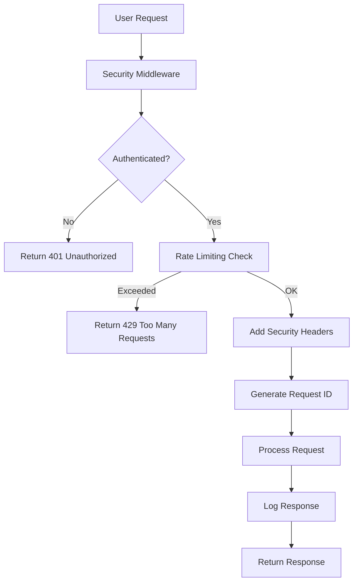

# Phase 1: Security Foundation & Authentication - Product Requirements Document

## 1. Product Overview

This document outlines the critical security foundation and authentication system for the AI Personal Assistant project. Phase 1 establishes a secure environment with proper secret management, user authentication, and security middleware before any AI integration.

The primary goal is to address immediate security vulnerabilities (exposed API keys) and implement a robust authentication system that will serve as the foundation for all subsequent phases.

## 2. Core Features

### 2.1 User Roles

| Role | Registration Method | Core Permissions |
|------|---------------------|------------------|
| Authenticated User | Google OAuth sign-in | Full access to AI assistant features, personal data management |
| Unauthenticated User | N/A | No access - all routes protected |

### 2.2 Feature Module

Our Phase 1 security foundation consists of the following main components:

1. **Security Configuration**: Environment variable management, secret protection, pre-commit hooks
2. **Authentication System**: NextAuth with Google OAuth, session management, user profile creation
3. **Security Middleware**: Rate limiting, security headers, request tracing
4. **Database Schema**: User profiles, integration tokens, authentication models
5. **Logging Infrastructure**: Structured logging with Winston, request ID tracking

### 2.3 Page Details

| Page Name | Module Name | Feature description |
|-----------|-------------|---------------------|
| Security Configuration | Environment Setup | Create .env.example with placeholder values, implement pre-commit hooks with secretlint, configure husky and lint-staged for secret detection |
| Authentication System | NextAuth Configuration | Implement Google OAuth provider with offline access, JWT and session callbacks, automatic user profile creation on first login |
| Security Middleware | Request Protection | Add CSP headers, X-Frame-Options, rate limiting with rate-limiter-flexible, request ID generation for tracing |
| Database Schema | User Management | Extend Prisma schema with UserProfile model (timezone, preferences, work hours), IntegrationToken model for OAuth tokens |
| Logging Infrastructure | Request Tracking | Implement Winston-based structured logging with request IDs, error tracking, security event logging |

## 3. Core Process

### Security Setup Flow
1. Developer sets up environment variables using .env.example template
2. Pre-commit hooks automatically scan for exposed secrets
3. All API keys are properly secured and never committed to version control

### Authentication Flow
1. User clicks "Sign in with Google" button
2. NextAuth redirects to Google OAuth with proper scopes
3. Google returns authorization code with offline access
4. NextAuth exchanges code for access/refresh tokens
5. System creates user profile if first-time login
6. User session is established with access token

### API Request Flow
1. Client makes request to protected API endpoint
2. Middleware checks authentication status
3. Rate limiting is applied based on user/IP
4. Security headers are added to response
5. Request ID is generated for tracing
6. All actions are logged with structured format



## 4. User Interface Design

### 4.1 Design Style

- **Primary Colors**: Blue (#3B82F6) for authentication elements, Red (#EF4444) for security warnings
- **Secondary Colors**: Gray (#6B7280) for secondary text, Green (#10B981) for success states
- **Button Style**: Rounded corners (8px), subtle shadows, hover animations
- **Font**: Inter font family, 14px base size for body text, 16px for buttons
- **Layout Style**: Clean, minimal design with focus on security messaging
- **Icons**: Lucide React icons for consistency, shield icons for security elements

### 4.2 Page Design Overview

| Page Name | Module Name | UI Elements |
|-----------|-------------|-------------|
| Authentication System | Sign-in Component | Google OAuth button with brand colors, loading states, error messaging with red alerts, success feedback with green indicators |
| Security Configuration | Developer Setup | Clear documentation layout, code blocks with syntax highlighting, warning callouts for security requirements |
| Security Middleware | Error Pages | Clean 401/429 error pages with helpful messaging, consistent branding, clear next steps for users |

### 4.3 Responsiveness

The authentication system is designed mobile-first with responsive breakpoints. Touch interactions are optimized for mobile OAuth flows, with larger touch targets for authentication buttons.

## 5. Technical Specifications

### 5.1 Environment Variables

```env
# Authentication
NEXTAUTH_URL=http://localhost:3000
NEXTAUTH_SECRET=your-secret-here

# Google OAuth
GOOGLE_CLIENT_ID=your-client-id
GOOGLE_CLIENT_SECRET=your-client-secret

# Database
DATABASE_URL=file:./dev.db

# Rate Limiting
RATE_LIMIT_POINTS=10
RATE_LIMIT_DURATION=1

# Logging
LOG_LEVEL=info
```

### 5.2 Database Models

```prisma
model User {
  id               String             @id @default(cuid())
  email            String             @unique
  name             String?
  image            String?
  emailVerified    DateTime?
  createdAt        DateTime           @default(now())
  updatedAt        DateTime           @updatedAt
  accounts         Account[]
  sessions         Session[]
  profile          UserProfile?
  integrationTokens IntegrationToken[]
}

model UserProfile {
  id          String   @id @default(uuid())
  userId      String   @unique
  displayName String?
  timezone    String?  @default("UTC")
  workHours   Json?    @default("{}")
  preferences Json?    @default("{}")
  createdAt   DateTime @default(now())
  updatedAt   DateTime @updatedAt
  user        User     @relation(fields: [userId], references: [id])
}

model IntegrationToken {
  id            String   @id @default(uuid())
  userId        String
  provider      String   // 'google', 'microsoft', etc.
  accessToken   String
  refreshToken  String?
  expiry        DateTime?
  createdAt     DateTime @default(now())
  updatedAt     DateTime @updatedAt
  user          User     @relation(fields: [userId], references: [id])
  
  @@unique([userId, provider])
}
```

### 5.3 Security Requirements

- All API endpoints must be protected with authentication checks
- Input validation using Zod schemas for all API parameters
- Rate limiting: 10 requests per minute per user/IP
- Security headers: CSP, X-Frame-Options, X-Content-Type-Options
- No sensitive information in logs (tokens, passwords, PII)
- Pre-commit hooks to prevent secret leakage

### 5.4 Testing Requirements

- Unit tests for authentication functions (80%+ coverage)
- Integration tests for OAuth flow
- Security tests for rate limiting and unauthorized access
- End-to-end tests for complete authentication flow

## 6. Success Criteria

### 6.1 Security Objectives
- [ ] All exposed API keys are rotated and properly secured
- [ ] Pre-commit hooks prevent any secrets from being committed
- [ ] All API endpoints return 401 for unauthenticated requests
- [ ] Rate limiting successfully blocks excessive requests
- [ ] Security headers are present on all responses

### 6.2 Authentication Objectives
- [ ] Users can successfully sign in with Google OAuth
- [ ] User profiles are automatically created on first login
- [ ] Sessions persist across browser refreshes
- [ ] Users can sign out and session is properly cleared
- [ ] Integration tokens are securely stored and managed

### 6.3 Technical Objectives
- [ ] Database migrations run successfully
- [ ] Structured logging captures all security events
- [ ] Request IDs enable proper request tracing
- [ ] All TypeScript types are properly defined
- [ ] Unit test coverage exceeds 80% for security components

## 7. Risk Mitigation

### 7.1 Security Risks
- **Risk**: API key exposure in version control
- **Mitigation**: Pre-commit hooks, .env.example template, developer training

### 7.2 Authentication Risks
- **Risk**: OAuth flow failures
- **Mitigation**: Comprehensive error handling, fallback mechanisms, user-friendly error messages

### 7.3 Performance Risks
- **Risk**: Rate limiting affecting legitimate users
- **Mitigation**: Configurable limits, user-specific quotas, clear error messaging

## 8. Dependencies

- Next.js 15 with App Router
- NextAuth.js 4.24.11
- Prisma ORM with SQLite
- rate-limiter-flexible for rate limiting
- Winston for structured logging
- Zod for input validation
- Husky and lint-staged for pre-commit hooks
- secretlint for secret detection

## 9. Acceptance Criteria

Phase 1 is considered complete when:
1. All security vulnerabilities are addressed (no exposed secrets)
2. Authentication system is fully functional with Google OAuth
3. All API routes are protected with proper middleware
4. Database schema supports user profiles and integration tokens
5. Structured logging is implemented and working
6. Unit tests achieve 80%+ coverage for security components
7. Documentation is complete and up-to-date

**Critical**: Phase 2 cannot begin until all Phase 1 acceptance criteria are met and verified through testing.